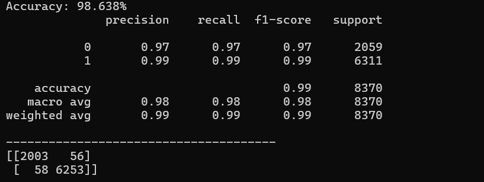

# Detect_end_of_sentence
Using NLP to detect end of the sentence 

Extracted following featurs out of the text which has help me to achive 98% accuracy
- Wordtotheleftof“.” (L) (values: English vocab)
- Wordtotherightof“.” (R) (values: English vocab)
- LengthofL<4(values:binary)
- IsLanumber(values:binary)
- IsRcapitalized (values: binary)

By utilizing Python's hashing concept for encoding during training and testing, I successfully improved the model's accuracy from 85% to 98%.
following it the classification_report 

